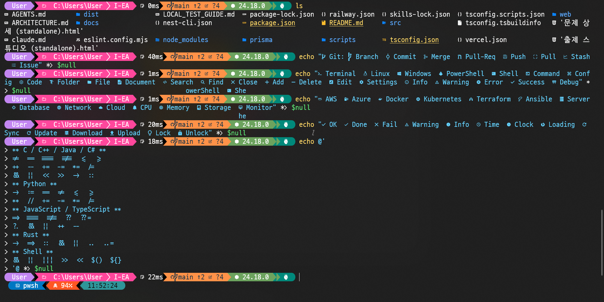
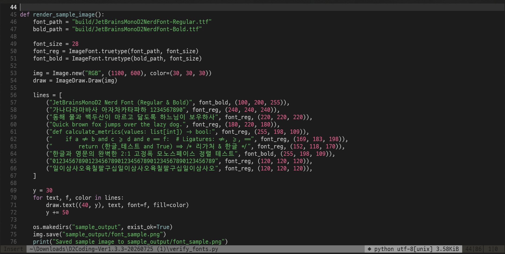

# JetBrainsMonoD2 Nerd Font 🚀

[English](README_en.md) | **한국어**

**JetBrainsMonoD2 Nerd Font**는 개발자를 위해 제작된 하이브리드 고정폭(Monospace) 코딩 글꼴입니다.  
**JetBrains Mono Nerd Font**의 가독성 높은 영문 디자인, 프로그래밍 리가처(Ligature), 최신 개발자 아이콘(Nerd Font v3)에 **네이버 D2Coding Ligature**의 깔끔한 한글 글리프를 결합하여, **완벽한 1:2 고정폭 그리드 정렬**을 제공합니다.

| 폰트 미리보기 1 | 폰트 미리보기 2 |
| :---: | :---: |
|  |  |
---

## ✨ 주요 특징

- **완벽한 1:2 모노스페이스 고정폭 정렬**:
  - **영문 / ASCII**: 너비 600
  - **한글 (Hangul)**: 너비 1200 (정확히 영문 2글자 폭)
  - 터미널, CLI 도구(tmux, neovim 등), VS Code/Cursor 등 코드 에디터에서 한글이 섞여도 칼럼 줄맞춤이 절대 깨지지 않습니다.
- **풍부한 프로그래밍 리가처(연자) 지원**:
  - JetBrains Mono 원본의 모든 코딩 리가처(`!=`, `=>`, `===`, `<!--`, `&&`, `||`, `::` 등)가 온전하게 작동합니다.
- **D2Coding 한글 11,445자 전체 수록**:
  - 현대 완성형 한글 음절 11,172자 (`U+AC00` ~ `U+D7A3`)
  - 한글 호환 자모 94자 (`U+3130` ~ `U+318F`)
  - 괄호/원문자 한글 및 CJK 특수 기호 포함
- **Nerd Font 최신 아이콘(v3) 내장**:
  - Git, 폴더, OS, 프로그래밍 언어, 프레임워크 등 수천 개의 개발자 아이콘이 기본 탑재되어 별도 아이콘 패치 없이 바로 사용 가능합니다.
- **시각적 밸런스 최적화**:
  - JetBrains Mono의 대문자 및 소문자 x-height에 맞춰 D2Coding 글리프를 1.15배 스케일링 및 수평 중앙 정렬하여 영문과 한글의 이질감을 최소화했습니다.

---

## 📦 제공 폰트 스타일 (4종)

- `JetBrainsMonoD2NerdFont-Regular.ttf` (일반)
- `JetBrainsMonoD2NerdFont-Bold.ttf` (굵게)
- `JetBrainsMonoD2NerdFont-Italic.ttf` (기울임꼴)
- `JetBrainsMonoD2NerdFont-BoldItalic.ttf` (굵은 기울임꼴)

---

## 📥 설치 방법

### 최신 릴리스 다운로드
👉 [**GitHub Releases (v1.0.0)**](https://github.com/rladnwls122/JetBrainsMonoD2-Nerd-Font/releases/latest)에서 `JetBrainsMonoD2-v1.0.0.zip` 또는 개별 `.ttf` 파일을 다운로드합니다.

### 🪟 Windows
1. 다운로드한 `.ttf` 파일들을 선택합니다.
2. 마우스 우클릭 후 **"모든 사용자용으로 설치"** (또는 "설치")를 클릭합니다.

### 🍎 macOS
1. **서체 관리자(Font Book)** 앱을 실행합니다.
2. 다운로드한 `.ttf` 파일들을 서체 관리자 창에 드래그 앤 드롭합니다.

### 🐧 Linux
```bash
mkdir -p ~/.local/share/fonts
cp JetBrainsMonoD2/*.ttf ~/.local/share/fonts/
fc-cache -f -v
```

---

## ⚙️ 에디터 및 터미널 설정

### Visual Studio Code / Cursor
`settings.json` 파일에 아래 설정을 추가합니다:

```json
{
  "editor.fontFamily": "'JetBrainsMonoD2 Nerd Font', monospace",
  "editor.fontLigatures": true,
  "terminal.integrated.fontFamily": "JetBrainsMonoD2 Nerd Font"
}
```

### Windows Terminal
`settings.json`의 `profiles.defaults` 아래에 글꼴 설정을 추가합니다:

```json
{
  "profiles": {
    "defaults": {
      "font": {
        "face": "JetBrainsMonoD2 Nerd Font"
      }
    }
  }
}
```

---

## 🛠️ 소스코드에서 직접 빌드하기

```bash
# 1. 필요 패키지 설치
pip install fonttools pillow

# 2. 폰트 병합 스크립트 실행
python merge_fonts.py

# 3. 폰트 무결성 검증
python verify_fonts.py
```

---

## 📄 라이선스 및 저작권 (License)

본 프로젝트는 [SIL Open Font License 1.1 (OFL-1.1)](LICENSE)에 따라 자유롭게 무료로 사용, 연구, 수정 및 재배포할 수 있습니다 (단독 유료 판매는 금지).

### 원작자 표기 (Credits):
- **D2Coding**: Copyright (c) 2015, NAVER Corporation (https://www.navercorp.com)
- **JetBrains Mono**: Copyright (c) 2020, JetBrains s.r.o. (https://www.jetbrains.com)
- **Nerd Fonts**: Copyright (c) 2014-present, Ryan L McIntyre & Nerd Fonts contributors
