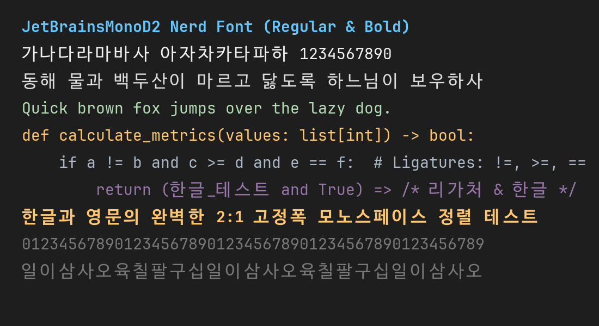

# JetBrainsMonoD2 Nerd Font 🚀

**English** | [한국어](README.md)

**JetBrainsMonoD2 Nerd Font** is a custom hybrid monospace font crafted for developers. It combines the sleek design, programming ligatures, and developer icons of **JetBrains Mono Nerd Font** with the clean and complete Korean glyphs of **D2Coding Ligature** — optimized for a perfect **1:2 monospaced grid alignment**.



---

## ✨ Key Features

- **Perfect 1:2 Monospace Alignment**:
  - **Latin / ASCII**: 600 advance width
  - **Hangul (Korean)**: 1200 advance width (exactly 2x English character width)
  - Eliminates broken column alignments in terminals, CLI tools (tmux, neovim, etc.), and code editors.
- **Rich Programming Ligatures**:
  - Preserves JetBrains Mono's native programming ligatures (`!=`, `=>`, `===`, `<!--`, `&&`, `||`, `::`, etc.).
- **Complete Korean Glyphs (11,445+ glyphs)**:
  - 11,172 modern Hangul Syllables (`U+AC00`..`U+D7A3`)
  - 94 Hangul Compatibility Jamo (`U+3130`..`U+318F`)
  - Enclosed & Circled Hangul characters, full-width CJK punctuation.
- **Full Nerd Font Icons (v3)**:
  - Includes Git, folder, OS, language, and filetype developer icons.
- **Balanced Visual Hierarchy**:
  - D2Coding Korean glyphs are scaled ($1.15\times$) and horizontally centered to harmonize seamlessly with JetBrains Mono's x-height and cap-height.

---

## 📦 Font Styles Included

- `JetBrainsMonoD2NerdFont-Regular.ttf`
- `JetBrainsMonoD2NerdFont-Bold.ttf`
- `JetBrainsMonoD2NerdFont-Italic.ttf`
- `JetBrainsMonoD2NerdFont-BoldItalic.ttf`

---

## 📥 Installation

### Download Releases
👉 Download `JetBrainsMonoD2-v1.0.0.zip` or individual `.ttf` files from the [Releases](https://github.com/rladnwls122/JetBrainsMonoD2-Nerd-Font/releases/latest) page.

### 🪟 Windows
1. Select the downloaded `.ttf` files.
2. Right-click and choose **"Install for all users"** (or **"Install"**).

### 🍎 macOS
1. Open the **Font Book** application.
2. Drag and drop the downloaded `.ttf` files into Font Book.

### 🐧 Linux
```bash
mkdir -p ~/.local/share/fonts
cp JetBrainsMonoD2/*.ttf ~/.local/share/fonts/
fc-cache -f -v
```

---

## ⚙️ Configuration

### Visual Studio Code / Cursor
Add the following to your `settings.json`:

```json
{
  "editor.fontFamily": "'JetBrainsMonoD2 Nerd Font', monospace",
  "editor.fontLigatures": true,
  "terminal.integrated.fontFamily": "JetBrainsMonoD2 Nerd Font"
}
```

### Windows Terminal
Add to your `settings.json` under `profiles.defaults`:

```json
{
  "profiles": {
    "defaults": {
      "font": {
        "face": "JetBrainsMonoD2 Nerd Font"
      }
    }
  }
}
```

---

## 🛠️ Building from Source

```bash
# 1. Install dependencies
pip install fonttools pillow

# 2. Run font merge script
python merge_fonts.py

# 3. Verify output
python verify_fonts.py
```

---

## 📄 License & Attribution

This project is licensed under the [SIL Open Font License 1.1 (OFL-1.1)](LICENSE).

### Credits & Trademarks:
- **D2Coding**: Copyright (c) 2015, NAVER Corporation (https://www.navercorp.com)
- **JetBrains Mono**: Copyright (c) 2020, JetBrains s.r.o. (https://www.jetbrains.com)
- **Nerd Fonts**: Copyright (c) 2014-present, Ryan L McIntyre & Nerd Fonts contributors
